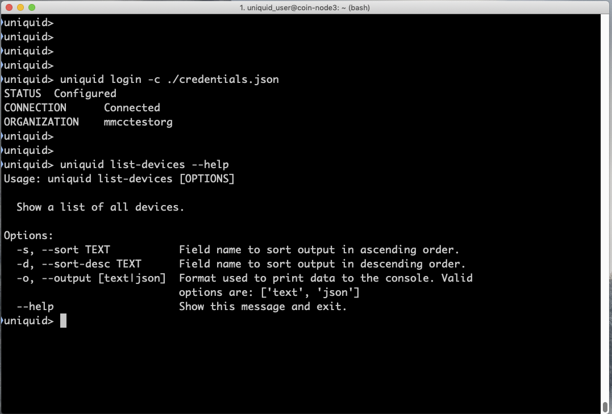
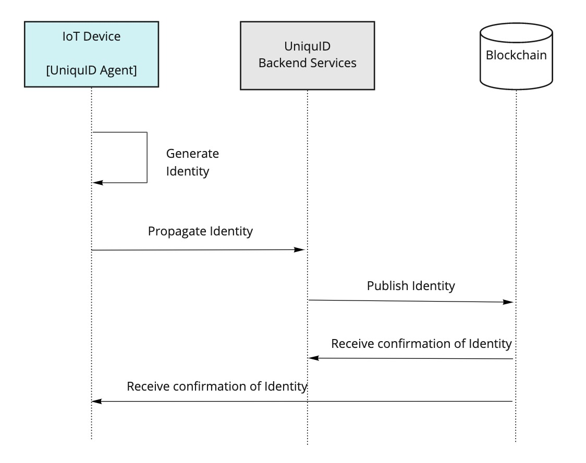
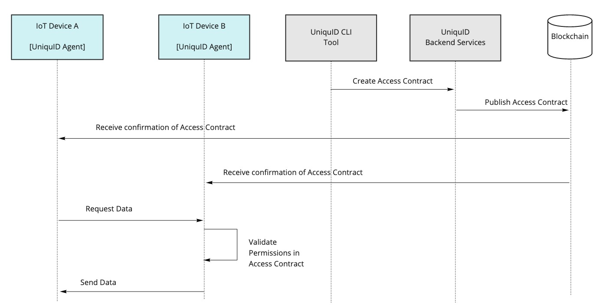
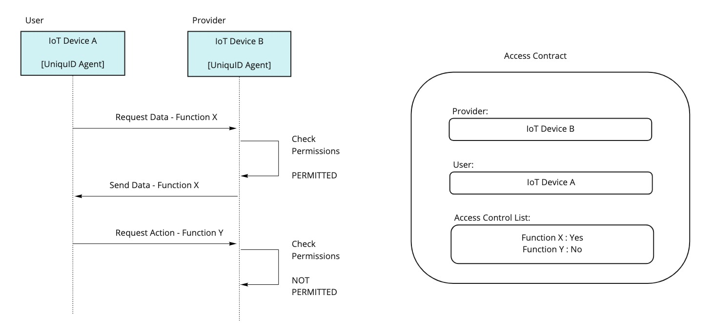
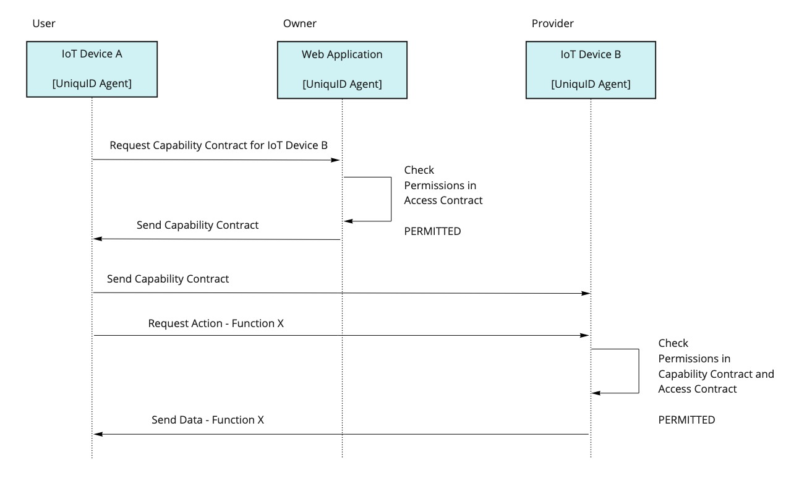

# Basic Topics

| **System Architecture** |
| :---: |
| Basic Topics |

| Document ID | uid-sys-arch |
| :--- | :--- |
| Version | 1.0 |
| Status | Release |

## 

## Introduction

This document aims to provide you with an understanding of how the UniquID system is designed and the elements of the system interact with each other.  The first section begins with a high-level description of the major system components, and then the following sections describe the operation of these components  in more detail.

## Glossary

Table 1.  Glossary of UniquID-specific Terminology

| Term | Description |
| :--- | :--- |
| Agent | UniquID’s core software component hosting its own unique cryptographic identity. An Agent can either offer or consume services with other Agents, as defined by a Contract. |
| Access Contract | A class of contract between two UniquID Agents, to grant or revoke access permissions. The Agent providing this contract verifies its validity by using transactions on the underlying blockchain. |
| Access Control List | The field within a Contract defining which resources are accessible and which actions are allowed between the Agents identified in the Contract itself. |
| Capability Contract | A class of contract to temporarily grant access to the Agent’s resources or actions.  The Agent providing access through a Capability Contract doesn’t need connection to the blockchain to verify its validity.  |
| Identity Self-Provisioning Service \(ISPS\) | A backend service to control how the unique identity of each Agent is provisioned in the system and it is distributed leveraging the underlying Blockchain. |
| Organization | A tool to identify  the domain within which a subset of Agents is managed, e.g., devices and applications pertaining to a single facility. |
| Permission Management Service \(PMS\) | The backend service to create and issue  access contracts between Agents. |

## What is UniquID?

UniquID is the Identity and Access Management system for Internet of Things and other decentralized applications:

1. It enables your enterprise to easily provision IoT devices and applications, providing an automated system to create unique cryptographic identities that work across your enterprise infrastructure and applications, without the need of a central authentication service. 
2. System architects, application designers, and administrators can then leverage these unique IoT devices identities to grant and revoke the permission to use specific Resources or perform certain Actions, by issuing UniquID Contracts. These Contracts control how IoT devices are offering and consuming resources and actions by leveraging decentralized blockchain transactions, instead of central authorization servers .

For example,  UniquID can manage the provisioning and control of your enterprise's IoT assets located at the edge of the network, such as industrial  gateways, sensors, actuators, appliances and software applications, leveraging its decentralized and interoperable blockchain to reduce the need for constant connectivity to the cloud, and complex Identity and Access Management system integrations.

UniquID is provided as a Software as a Service offer by default. Self hosting, dedicated instances and other options are available.

Software and system developers simply need to integrate UniquID’s Agent SDK within your devices and applications, and connect them to UniquID’s ISPS and PMS services.  Once connected, these services automatically:

1. Provision new devices and applications on UniquID’s blockchain
2. Enroll their digital identities into your unique Organization
3. Control them by issuing and revoking Contracts.

## When to use UniquID \(not exhaustive example use cases\)

Developers can use UniquID to mitigate the multiple issues related to device Identity and Access Management \(IAM\) inside distributed IoT networks. UniquID is designed to support the availability, integrity and confidentiality of IoT devices whenever the traditional, cloud-centric systems are not suitable in terms of maintenance overhead, identity services availability, and computational trust dependencies. 

Some examples use cases implementing of UniquID are: .

### **Vehicle Access Control System**

This use case enables the owner of a connected vehicle to use their smartphone/PC to issue and revoke access Contracts to drivers, mechanics, insurance platforms, valet services, parking and any other type of access to the vehicle or the data generated from it, controlling  when and for how long this access will be provided.

The owner can be also a  fleet manager,who can control a large number of vehicles without any change to the system. The Access Control rules are automatically embedded in the Contracts and distributed via the underlying Blockchain, so they are enforced locally \(no persistent connection to remote authentication and authorization server are needed\).

### **V2X**

In this scenario, a connected vehicle has to communicate in a secure way with other vehicles and the roadside connected equipment, overcoming the limits imposed by different jurisdictions, digital standards and manufacturers. UniquID’s solution is designed to enforce the security of the communication protocols with a distributed solution that is simpler and less expensive to deploy, maintain and scale up than a global centralized PKI of every entity interconnected by the system.

### **Smart Meters**

In this scenario, energy utilities have to bill the supplied electricity to consumers. To measure electricity consumption, the energy company installs smart meters in consumers’ buildings. These meters send energy consumption information through a central authentication and authorization hub at the energy company. 

In order to ensure the communication security between the smart meters and the company’s authentication and authorization hub, UniquID’s solution grants a decentralized method to verify that  data is correct before it’s dispatched in the cloud. Also, this solution allows you to encrypt the data in motion without using a remote authentication service, mitigating the risk of MITM-attacks. The distributed nature of UniquID’s underlying blockchain  provides the ability to control a large amount of sensors \(smart meters\) by simply broadcasting batches of signed transactions.

### **Wifi access for guest users**

Within this scenarion, a wifi provider \(e.g. a Telco operator or a Company\) can use UniquID’s solution to grant anonymous/guest access to an existing WiFi network, without transmitting any credentials \(such as passwords or certificates\), nor authenticating the user through the usual _Captive Portal_. With UniquID, the access is tracked and logged by a traditional access control system \(e.g. a Radius server\), integrated with UniquID Contracts in the back-end. This solution collects the public key of a device from the underlying blockchain, therefore removing the provisioning of the guest in every centralized Radius server that provides WiFi access, reducing guests’ credentials management and maintenance overhead.

### **Zero-touch configuration appliance**

An IoT-enabled appliances manufacturer uses UniquID’s Identity Self-Provisioning Service \(ISPS\) to identify and pre-provision its products  before they leave the manufacturing facility, loading its configuration only when the appliance is sold to the final client. Once the appliance is paid, the configuration is embedded within a Contract and transmitted via the underlying Blockchain. This operation drastically reduces the installation costs and overhead, while enabling third-party service providers to securely install these appliances without the need for any “administrator” privilege. With the current release, millions of appliances can be remotely managed in this way.

### **IoT device identification and Cloud access without Certification Authorities**

Within this scenario, an IoT devices manufacturer can leverage UniquID’s solution to grant an access to its private/hybrid/public cloud services without managing signed certificates, or hard-coded API passwords.  Above a critical amount of endpoints \(~100,000\) UniquID’s solution becomes more efficient that traditional CA solutions, by enabling the provisioning and configuration of thousands of devices in a few minutes, just by leveraging a single script. Moreover, the IoT devices manufacturer doesn’t have to deal with wild-card certificates, Certification Authorities  and to set-up/run an internal Public Key Infrastructure \(PKI\). The blockchain-based identity provided by UniquID is compatible with secure-element based solutions, and is less expensive on large volumes.

### **Secure Medical Document Workflow**

Within  this scenario, a patient can automatically share their medical files with  doctors across hospitals. The medical files are encrypted using keys owned only to the patient, and then stored in the cloud. The decryption keys are exchanged usingUniquID-enabled applications, which leverage blockchain transactions to enforce the authorizations without relying on trusted third parties. This architecture ensures that medical files can be distributed openly, but only the patient's device is capable of enabling access to them.

An example of the process is:

* The patient's medical data is stored in the cloud, in an encrypted form.
* The patient enters into an agreement for the provision of medical services at a clinic or hospital. A key point of the agreement is to permit the binding of the patient's device \(a tablet, personal computer or smartphone\) to the backend services of the clinic. The doctor’s devices are already bound to the backend services of the clinic.
* The patient visits a new doctor, bringing with them the personal smartphone that holds the Contract to authorize new devices.
* The doctor requests to see the patient's medical data on their work computer.
* The patient scans a QR code from the doctor’s work computer and permits the sharing of their medical data with this doctor’s computer.
* The patient's smartphone provides a one-time key to decrypt the medical data.
* The doctor's computer downloads the patient's encrypted medical data from the cloud and then decrypt it. This allows the doctor to examine the data they require.
* The doctor prescribes a treatment for the patient.
* The patient leaves the clinic and revokes the authorization to their medical data. From this point, the doctor cannot access the patient’s private medical data.

## When not to use UniquID

Although UniquID is an ideal fit for many use cases, there exist a few use cases which is not suitable for.

UniquID, as a stand-alone Identity and Access Management platform, is not efficient to identify and authenticate people: these solutions must provide a trusted process to capture and verify the personal data of the user. This process must follow  controlled procedures, where the binding process between a person and their digital identity should be certified as valid and broadly accepted. As an example, the provisioning of a new user on the blockchain, since irreversible, should be performed within an audited process, which is responsible for the verification of a government-issued document before enabling the access to a banking account. This process can be simplified by adopting a smartphone to issue and revoke credentials: in this case, the user digital identity can be stored inside the device itself, and controlled via biometry \(e.g., fingerprint or face recognition\). UniquID’s Agent software might run on the smartphone, thus enabling machine-to-machine secure authentication and authorization with the application server on the other end of the connection, but the solution is evidently more complicated if compared to more traditional approaches. 

 UniquID suffers the same type of complication within _Self-Sovereign Identity_ platforms, which leverage a self-defined personal digital identity maintained by a decentralized system, with no central authorities such as governments or credit institutions. UniquID is not a Self-Sovereign Identity system for people, however it includes by design the decentralized sub-system needed to plug Self-Sovereign identities  with IoT devices.

This scenario, once broadly adopted, might unlock the phase where UniquID-enabled devices become efficient also to authenticate human users which are registered under Self-Sovereign identity conditions. The most common device is the smartphone, therefore a UniquID-equipped app, running the Agent, might carry its own unique identity be easily linked to the owner identity, leveraging the same principles that today allow mobile users to operate with their bank accounts. So, as long as a platform can trust a smartphone app running UniquID Agent, and as long as the provisioning of the owner within the mobile app can be trusted, your solution can trust the user indirectly through the UniquID IAM principles \(furthermore if the smartphone is protected by the user’s biometry\).

Since we can predict a large adoption of biometric authentication by smartphone manufacturers, and we can predict a very large diffusion of personal and wearable IoT devices, UniquID can support the futuristic vision where every time we use a connected device we strengthen our digital authentication by providing a physical context. For example, a person sitting inside a self-driving car cannot be also sitting in front of the enterprise’s computer, or trying to open the office door by using the company badge.

More in general, UniquID solution is designed to simplify the Identity and Access Management of large sets of devices, while keeping the overhead as small as possible. Therefore, even if the system efficiently works with very minimal configurations \(2 connected devices or 2 connected applications\), you can get all the benefits of the solution when managing hundreds of thousands of IoT devices and interconnected cloud services.

## How UniquID Works

### **Overview**

UniquID enables enterprises to scale the deployment of large numbers of IoT devices, by providing tools that securely automate:

* The provisioning of new devices \(by enrolling their digital identity\)
* The control of the permissions that grant access to the data generated by these devices.

By leveraging these two principles, UniquID allows you also to manage access permissions between  IoT devices and applications running inside your IT infrastructure, since UniquID Agent is designed to provision and control also standard applications running on cloud instances and server on the premises.

Devices and applications which incorporate the UniquID functionalities are referred to as UniquID _Agents_. _Contracts_ between _Agents,_ stored and trusted by the blockchain_,_ are used to grant and revoke permissions \(see the dotted lines\).

Fig. 1.  UniquID System Components

### **Major System Components**

#### **UniquID Console**

The Console is a web application to administer your Organization account and the Agents provisioned into it. t UniquID Console provides the following functionalities:

* Create an account for your Organization.
* Create an administrator user for your Organization.
* Download the credentials file storing the access authorization for the administrator.
* Delete the account for your Organization.

You can access the Console at the address [https://uniquid.com/console](https://uniquid.com/console) .

#### **UniquID Backend Services**

UniquID provides a managed infrastructure which provides the access to the backbone of the system. This system is provided via a Software as a Service \(SaaS\) solution that removes the need to invest time and effort in the design, development and maintenance of the backend infrastructure. Upon request and for large installations, backend services can run inside clients’ private or hybrid infrastructure.

UniquID’s backend services run  behind HTTPs RESTful APIs which can be integrated within your applications. You can use these APIs to:

* Generate a list of all provisioned Agents\* inside your Organization.
* Generate a list of all current and revoked contracts between Agents.
* Issue a contract to grant permissions between two Agents.
* Delete a contract to revoke permissions between Agents.

\*As mentioned, an Agent can be an IoT device or an application.

#### **Blockchain**

UniquID’s system currently leverages the Litecoin public blockchain to store the contracts that grant and revoke permissions between UniquID Agents. The use of this distributed blockchain ledger means that UniquID agents can verify the validity of its entries \(which contain the Contracts\), thus validating the permissions granted to Agents, without connecting to UniquiD’s Backend Services.  This is the major benefit of using a distributed blockchain technology: since individual Agents do not need to send queries to centralised backend services, they are capable to validate an access request from another Agent by trusting the ledger entries and their integrity \(enforced by the underlying Proof of Work algorithm\). All the information required by the Agents to authorize the access is available on the public blockchain. 

UniquID’s blockchain protocol also provides an immutable record of the contracts created to grant and revoke permissions. This feature provides a permanent record of how and when permissions were changed, which is designed to support audit and traceability purposes.

#### **UniquID Command Line Interface \(CLI\) Tool**

To simplify the usability and the flexibility of the platform, UniquID provides a command-line tool which allows you to easily access all of the methods of UniquID RESTful APIs.  This tool enables the system administrator to control the status of all entities inside the Organization, and issue or revoke access permissions if required.

The tool provides the following functionalities:

* View a list of all provisioned Agents.
* View a list of all contracts between Agents.
* Create a contract to grant permissions between Agents.
* Delete a contract to revoke permissions between Agents.
* Deploy the Agent into an AWS EC2 instance, which automatically integrates AWS IoT Core with your UniquID Organization.
* Delete the EC2 resources which were previously deployed by an AWS IoT Core integration command and restore AWS to its previous state.

Fig. 2  UniquID Command-line Tool

UniquID CLI tool can be automatically installed using the Python package management tool 'pip' and the command ‘pip install uniquid’.  The CLI provides a conventional shell interface, therefore it is ready to be integrated into automation scripts and your existing deployment processes.

#### **UniquID Agent**

The Agent is the core element of the platform, and is responsible to pair any IoT device or application with its own unique identity inside UniquID distributed platform.  
In order to provision an IoT device inside your UniquID Organization, you have to run a valid UniquID _Agent_ on it. To leverage UniquID IAM platform capabilities, IoT devices and applications have to leverage their Agent. 

Agents can be integrated with the software or firmware of the IoT device or the application, by using UniquID’s Software Development Kit \(SDK\).  Currently, UniquID SDK supports the following programming languages:

* Java
* Javascript, Typescript and Node.js
* C, C++

There are cases where the Agent cannot be installed directly on IoT devices: the approach remains the same, however UniquID is run at the gateway level, providing a proxy functionality.

### **Identity Management**

UniquID provides a service to create a unique cryptographic identity for each Agent enrolled in the system. The service runs on top of a public blockchain, therefore an Asset’s digital identity is unique among the whole set of customers, organizations and applications/devices \(as of today, a total space of 2^256 unique private keys\).

UniquID identities can be generated and deployed during one of these exemplification moments:

* After an IoT device is assembled on the production line \(e.g. burn-in test\)
* After an IoT device is delivered to a distributor and is ready to be provisioned
* After an IoT device is installed at the customer’s premises and is tested
* As soon as an Application instance is run the first time
* Every time a stateless Application is executed \(e.g., a Docker container\)

Newly instantiated UniquID Agents are designed to randomly generate their own unique identity \(by leveraging any locally available entropy generators\) and then propagate the resulting public key to the Agents in the system that finalize the provisioning by writing it on the blockchain \(the ISPS service\). This process of identity self-generated is close to _Self-Sovereign Identity_ principles.

Fig. 3.  Identity Provisioning Sequence

In practical scenarios, when an IoT device is powered for the first time it generates its own UniquID Agent private key and then it broadcasts the resulting public key across a local, trusted channel to the UniquiD backend services. 

Once the backend services receive a new Agent identity, an administrator Contract is created. This contract binds the Agent embedded inside the new IoT device to your Organization, granting administration rights.  As soon as the new Contract is written on a new block inside the blockchain, the Organization can grant or revoke permissions between the other existing Agents and the new provisioned IoT device.

### **Permissions Management**

UniquID Permissions Management is designed to grant or revoke permissions between Agents, which can be IoT devices or Applications. 

Every Agent can be granted a specific set of permissions toward another Agent by its administrator: as an example, it may provide the rights to execute certain actions \(open/close, raise/lower, push/pull\) or the rights to read or write data.

Equally, revoking these permissions will take away an Agent’s ability to perform such activities.

Each UniquID Agent evaluates any incoming request as soon as it is received by another Agent, to determine if the permissions exist. 

#### **Access Contract**

UniquID governs these permissions using Contracts written on the public blockchain. A standard type of UniquID Contract is the _Access Contract_, which contains an array of unsigned integers that maps each of them to the actions that a given IoT device or application can do, such as sending the requested data, or performing the requested action.  If no valid Access Contract is present on the blockchain, the UniquID Agent will deny the request, blocking its execution on the underlying application.

UniquID Agents must have periodic access to the blockchain to download any new Access Contracts. Once retrieved, new Access Contracts are cached locally inside the Agent, so it may not need to query the blockchain every time a new access request is performed. Therefore, an UniquID Agent can validate the request with a lower latency, or without using a WAN connection, improving the system performance.

Fig. 4.  Granting Permissions Sequence

Fig. 4 show an example of Access Contract being used between two IoT devices “IoT Device A” requests data from “IoT Device B”.  
“IoT Device B” will always reject these requests unless an Access Contract with “IoT Device A” is in place.

In this example, a valid Access Contract between the two devices has been previously created using the CLI tool and the Backend Services.  As soon as “IoT Device B” downloads the Access Contract from the blockchain, it verifies its validity, stores it in the local cache, and enables “IoT Device A” to request the data.

Please note that Device A, Device B and the Backend Services don’t share a trusted, direct connection to exchange Access Contracts, but leverage instead the underlying public blockchain.

Access Contracts can be issued on the blockchain using the UniquID CLI tool, or by directly sending queries to the UniquID Backend Services RESTful APIs. 

The Access Contract is defined inside JSON formatted inputs. 

This JSON file must contain three fields:

* The public key of the Provider Agent \(defined by the xPub format\). The Provider Agent hosts the service or the data we want to authorize toward the User Agent. 
* The public key of the User Agent \(defined by the same xPub format used above\). The User Agent  is the client that needs access to the service or the data hosted by the Provider Agent. As mentioned, the Provider Agent needs the Access Contract written on the blockchain before it can authorize the User Agent to access any available resources.
* The Access Control List \(ACL\). This field specifies which services or resources are affected by the contract. In the standard Access Contract, they are identified by an array of unsigned integers, which may be used to map a set of instructions in the underlying application.

Fig. 5.  Access Contract Sequence

#### **Capability Contract**

For large-scale, high-frequency and offline Contract needs, UniquID provides the _Capability Contract_ class. This type of contract is designed to grant permissions among a pool of Agents, only for a limited duration of time, without issuing Access Contracts between between each and all of them. The Capability Contract works similarly to a traditional authentication token: once the allotted time expires, the permissions are no longer valid and a new Capability Contract must be issued.

Capability Contracts are designed to be validated by the Provider Agent that has no Internet connectivity, thus has no ways to fetch UniquID’s underlying blockchain. Therefore, a Provider Agent using a Capability Contract is able to authorize a User Agent  in situations where they have limited network and blockchain connectivity.

Fig. 6.  Capability Contract Sequence

Fig.6 shows the sequence diagram of a Capability Contract used to grant access between UniquID Agents. In this scenario, there is also the Owner Agent together with the User and Provider Agents there is also the “Owner” Agent.

 The Owner Agent is trusted by the Provider Agent by leveraging a previously issued Access Contract.To create a new Capability Contract, UniquID requires two Access Contracts in place: 

* one between the User Agent and the Owner Agent
* one between the Owner Agent and the Provider Agent.

By issuing these two Access Contracts, the administrator puts in place the permissions to leverage, later on, a Capability Contract. Once these two contracts are in place, the User Agent can request the Owner Agent to issue a Capability Contract, such that it gives permission to access the resources provided by the Provider Agent. As usual, upon receiving the Capability Contract, the User Agent can cache it for later usage, until it expires.

During the handshake, the User Agent sends a request to the Provider Agent, providing two key data:

* The Access Contract they have with the Owner Agent
* The Capability Contract, which embeds the Access Control List \(ACL\).

If both contracts are valid, and the requested resources is allowed by the Capability Contract signed by the Owner Agent, the Provider Agent accepts the request, applying the same logic of the standard Access Contract. By design, theCapability Contract is not stored on the blockchain.

## **Security**

### **Blockchain basics**

A blockchain is a networked, append-only data structure storing data records called transactions. These records are organized in logically sequenced blocks that are linked by a chain of unique cryptographic hashes.

This data structure is normally replicated on every computer that joins the network \(as nodes being part of a mesh network topology\) and every write operation on this network is regulated by a fully distributed consensus algorithm. Unlike any other conventional distributed database architecture, there is no central server that controls the writing operations, and there is no mechanism to assign a different server to lead the network if the main database server breaks down for any reason. This is the fundamental promise of, blockchain architectures, and so these are called “decentralized”.

As mentioned, the consensus algorithm updates the state of the blockchain by distributing new transactions to all nodes in the network. In the case of Bitcoin and Nakamoto-consensus blockchains, it leverages with a peer-to-peer protocol with two different layers of consensus between the nodes: The first layer requires that all the nodes validate a newly proposed transaction against their local copy of the blockchain before relaying it to other nodes. It ensures the consistency of the data structure. The second layer of consensus requires the solution of a cryptographic puzzle, based on proof-of-work principles, for the creation of a new block. A newly proposed block must contain a valid solution to the puzzle, and the protocol requires that all nodes validate this solution against the local copy of the blockchain before relaying it to other nodes.

Transactions are bundled inside new blocks using merkle trees \(referred reading, page 40\), to leverage the proof-of-work to certify their integrity at the moment of their spending. The creation and validation of new blocks is at the core of the security of the blockchain; and there are alternative consensus algorithms with different characteristics for finality, consensus and performance. Creating new blocks is conventionally called “mining”, which means that creating new cryptocurrency from the cryptographic solution that is needed to create a new block. Newly created blocks have a unique hash, which is a unique cryptographic fingerprint generated from: The hash of the previously “mined” and most recent block The timestamp of the puzzle solution The solution of the puzzle \(in case of Bitcoin’s HashCash, the nonce\) The merkle root of the transactions Low-level protocol data \(version and HashCash target\)

Since the consensus algorithm identifies the state of the blockchain from the highest available block number and its cumulative proof-of-work, nodes must solve the cryptographic puzzle starting from the most recent block. It ensures that the convergence to a single blockchain in case of competing blocks is solved at the same time. Technically, the protocol mitigates the chance of two or more “conflicting” chains by measuring and adopting the longest “chain” of proof of work to append a new block. In practical terms, the probability of concurrent blockchains drops exponentially at each new mined block, and \(in the case of Bitcoin\) the probability of two equally concurrent forks, with six blocks each, is 0.0002428.

UniquID recommends waiting for at least three blocks before considering a transaction sufficiently reliable to be used for Identity and Access Management purposes. However, all transactions are visible within a few seconds from their creation and the system can provide acceptable User Experience during this validation period.

UniquID’s Architecture leverages four basic principles of a blockchain:

1. Distributed Replicated Database  Every node on the Blockchain has unrestricted access to the entire history of transactions and cryptographic information to validate their integrity, without the need for a trusted third party. Since single nodes cannot modify this data without breaking its cryptographic proofs, applications can locally generate read-only databases on top of verified blockchain data.
2. Peer-to-Peer Communication  Nodes communicate directly with other peers on the network, without querying central coordination services \(except at the first software execution\). Each node keeps a local list of reliable peers, picking distant public IP ranges to mitigate the risk of centralization, and ranking them by latency and bandwidth. Any new information, such as blocks and transactions, is normally: received from one of the 8 peers validated through the local consensus rules and \(if valid\) relayed to the other 7 nodes. As of the writing of this section \(September 2019\), the gossip protocol responsible to broadcast new transactions and block headers across the network \(comprised of ~1600 Litecoin nodes\) needs less than 3 seconds. UniquID leverages this network to ensure the propagation of the access contracts, and the integrity of the rules used by its Identity and Access Management platform.
3. Data Transparency  Transactions and their nominal values are visible to anyone hosting a full copy of the blockchain. For this reason, nodes don’t store any sensitive data about the user, mitigating the risk for their privacy. However, users can choose to provide proof of their identity to third-party \(e.g. financially regulated services, such as exchanges and e-commerce websites\). UniquID’s transactions occur between Blockchain addresses stored inside devices and these do not require users’ identities.
4. Irreversibility of Records  After a block is generated and linked to its previous block in the chain \(mined,\) the entire network begins to work on a new block, competing to solve the next available puzzle and capture its cryptocurrency reward.  Therefore, more the number of blocks are created after a transaction is confirmed, the higher is the amount of proof-of-work to rewrite that transaction in order to spend it again. Since any modification of the transactions in a block will change the entire merkle tree and the hash of its original block, the nodes of the network will reject the tampered block unless the proposing node can also provide the proof-of-work for that block and the subsequent ones, surpassing the currently leading blockchain. This allows UniquID protocol to deem irreversible any transaction that is older than six blocks and less than 15 minutes.

###  **Blockchain node security basics**

The security of the blockchain protocol used by UniquID is derived from the coordination of its network of nodes around the same consensus rules, and the assumption that 51% of these nodes are behaving honestly. The credibility of this approach was proven by:

* More than 10 years of uninterrupted availability \(Bitcoin infrastructure runs successfully since Jan 3rd 2009\)
* The absence of documented or successful double spend attacks
* An increasing number of value exchanged

The nodes of a public and unpermissioned blockchain don’t need a central identification/authentication/authorization process to gain access to other nodes, however, they leverage standard asymmetric cryptography with public/private keys pair to issue transactions. Essentially, every node generates its own set of public keys, and each of these public keys is communicated out-the-band to other nodes to receive an incoming transaction.

Every node must store and backup its own keys in a secure way, since there is no equivalent of a central keystore, which removes the risk of takeovers of the network by compromising a central server, but introduces the burden of managing data losses.

The identity of a node is pseudonymous across many public keys \(as many as the incoming transactions\), and requires the authentication only at the moment of spending the amount of cryptocurrency associated to a specific public key. Since there is no trusted third party that stores these keys, the funds are safe as long as the machine hosting its wallet is not compromised.. As of today, UniquID suggests the protection of the private keys by using a Secure Element and a Trusted Execution Environment \(TEE\) on the host devices. In any case, even if an attacker successfully takes over a minority of the nodes, the rest of the system remains unaffected.

####  **Message corruption**

A node signs the transaction with its own private key, so the message cannot be corrupted \(e.g. changing the public key of the recipient to steal the funds\) by the other relaying nodes during the transmission.

Since the first layer of consensus in the protocol requires the receivers of a new incoming transaction to check its integrity against the authentication of the transaction author through its signature, the transaction messages are safe for transmission even in the absence of encrypted and/or trusted messaging platforms.

####  **Unauthorized record modifications**

The mining operation, defined as the second layer of consensus, seals batches of new transactions in a new block by using merkle trees and the hash of the previous block header, and any change to a single transaction in the block will alter this resulting hash. Therefore, if an attacker wants to change a transaction in a past block, he/she must change all subsequent block headers. As long as the rules of the consensus algorithm are enforced by the nodes and follow the longest chain of valid blocks \(measured by the amount of their proof-of-work\), an attacker must be able to accomplish the mining of the tampered block and all the subsequent ones, before the rest of the honest nodes completes the mining of just the current block. By definition, the proof-of-work stored in six subsequent blocks of the \(Bitcoin and Litecoin\) blockchain is sufficient to consider a transaction final and tamper-proof.

####  **Infrastructure denial of service \(DoS\)**

The absence of central servers allows a blockchain-based infrastructure to achieve exceptional resistance against denial of service attacks. Even if an attacker can have an impact on very large groups of nodes \(e.g., nationwide Internet shutdowns\), the network of remaining connected nodes will continue to work and will maintain the consistency of the ledger. Thanks to the proof-of-work and the mining consensus roles, when the other nodes reconnect to the rest of the network, they will synchronize to the latest state of the chain, and will restart their relaying functionalities.

The underlying peer-to-peer communication between the nodes makes the network sufficiently fast and reliable for UniquID consensus needs, since the frequency of variations in the IAM system are compatible with the latency of the blockchain.

There are no main or distribution nodes that are crucial for communication. Every node in the network has the same chance to receive messages and to dispatch these. A shutdown of the communications between some nodes will result in isolation of those nodes in question, until they will be reconnected and resync to the others, but the network will continue to work.

####  **Double spending**

The blockchain is a protocol to transfer value \(coins\) between digital wallets, which are represented by their public keys. The first layer of consensus of the protocol is responsible to verify that a sender can’t spend more coins than what is available within the wallet public key. When a user issues a transaction, he/she creates an instruction which moves a certain amount of currency from a public key under his/her control to another public key \(represented by a blockchain address\). This instruction must contain the originating transaction of the money \(normally, a transaction from another user stored in a previous block\) and its authentication, by generating a cryptographic signature of the new transaction with the wallet private key. Once the transaction is signed, the node broadcasts the payload to its peers. The receiving node mathematically verifies if the sender is using coins in his availability and the correct signature, by applying the first layer of consensus. If the verification fails, the transaction is rejected. This operation needs consistency of the ledger across all the nodes, and therefore the blockchain is completely public.

UniquID uses the Litecoin Blockchain. Litecoin is a fork of the Bitcoin codebase, therefore it shares the same blockchain principles, and guarantees the irreversibility of the records using a different “Proof of Work” algorithm, based on “Scrypt” hashing \([https://en.wikipedia.org/wiki/Scrypt](https://en.wikipedia.org/wiki/Scrypt)\).

All the Cryptography that secures the Litecoin Blockchain is based on Elliptic Curves cryptography \(ECDSA, [https://en.wikipedia.org/wiki/Elliptic\_curve](https://en.wikipedia.org/wiki/Elliptic_curve)\) that offers a strong security with a reduced computational footprint when compared to the “RSA” cryptography.

###  **UniquID Access Contracts**

All UniquID access contracts are Litecoin transactions that spend small amounts of cryptocurrency from the wallet of the “provider” to the wallet of the “user” - which implies that contracts are authenticated by the “provider” with its private key.

The access contracts \(as cryptocurrency transactions\) are written on the Blockchain, and are retrieved by the authorized “user Agent” directly from the blockchain itself, leveraging the standard consensus rules to validate data integrity.

UniquID access contracts store the following information:

* A public key of the “provider” Agent \(the agent that accept requests\)
* The hash of a public key of the “user” Agent \(the agent that sends requests\)
* The access permissions \(the Bitmask\)
* The revoke UTXO \(output\)

The authorization is stored inside a particular output of a standard transaction, called OP\_RETURN, that is commonly used for binding additional data to the transaction itself. The public key information stored on the contract allows each Agent to securely identify and trust the counterpart, by verifying the transaction private key signature, and the authorization level stored in the OP\_RETURN field.

The Litecoin blockchain guarantees the logic layer for the distribution, censorship resistance, and availability and non-repudiation of these access contracts. UniquID Agent security When a new Agent is started, it generates its own identity keypair, and then sends the resulting name and public key information to the Identity Self-Provisioning Service \(ISPS\). An Agent’s public key is generated from the seed, and leverages the standard blockchain address derivation of the wallet \(BIP32\).

As soon as the ISPS receives data from the new Agent, it sends a transaction to the Blockchain, supplying a small amount of cryptocurrency to the Agent. This first transaction, which contains a public key of the ISPS wallet and the hash of a public key of the Agent \(Litecoin address\), is the access contract that establishes a root of trust between the Permission Management Service \(PMS\) responsible for the orchestration of all the Agents of a specific organization. Once this root of trust is established, the PMS can ask the Agent to sign additional access contracts toward other devices. Therefore, the private key of the PMS must be secure to avoid the issuance of unauthorized access contracts on the blockchain. Message security and RPC Each communication between two UniquID parties \(ISPS, PMS and Agents\) is secured by UniquID access contracts.

The messages do not rely on the nodes of the Litecoin network, but on a separate communication channel \(usually MQTT with signed messages\), secured itself by UniquID access contracts.

The current release of the protocol provides authentication of the Agents by using message signature. Each message exchanged between Agents is signed with the ECDSA algorithm, using the same private key corresponding to the public key in the contract. In this way, the “provider” Agent can verify the “user” Agent sending the message, by mapping it with the associated contract, and granting the access permissions defined into it.

#### **Contract revocation**

Because the blockchain does not allow deletion of any information, UniquID adopted a proprietary logic to mark an Access Contract as revoked \(deleted\), adding to each transaction an additional output that send cryptocurrency to a third party Agent called “revoker”. By leveraging this logic, UniquID can consider valid an Access contract as long as the “revoker” output \(UTXO\) is not spent. There is no restriction on the Agent playing the role of the “revoker”, the only condition is that a revoking UTXO must be spent giving 50% of the amount to the “provider” and 50% to the “user”, for future uses.

By default, the revoking UTXO is assigned to the “provider” itself, such that a PMS sends the revocation to the “provider”, signing the transaction that spends the revocation UTXO. However, a developer can easily implement other revoking schemas, including centralized servers or multi-signature validation. Encryption Data encryption is not currently implemented within the UniquID Agent, to keep the computational footprint as light as possible. However, the encryption can be added by leveraging the ECDH primitives already implemented in the Agent libraries. With the ECDH algorithm, two parties generate a common shared secret starting from the knowledge of their own private key and the public key of the counterpart. The generated shared secret is used as the key to perform symmetric encryption of the messages.

By enabling this functionality, UniquID Access Contracts remove the complexity of certificates rotation, enabling end-to-end encryption accessible without Certification Authorities and their expensive management.

### **Common attacks and mitigation**

**Replay attack**

Each message exchanged between UniquID Agents contains a timestamp. This timestamp is part of the message authenticated by the Agent wallet \(using ECDSA primitives\), therefore it cannot be modified without invalidating the signature.

After the message verification, a receiver checks the timestamp against the current time and accepts the message only if the timestamp falls in a defined range \(default +/- 60 sec, customizable as needed\).

In this way, a replay attack may succeed only during the time of the range. This method for the replay attack mitigation makes the communication protocol as simple as possible.

**Man-in-the-middle attack**

Since each message is signed by the Agent using the private key, an attacker able to eavesdrop on the channel cannot modify the message without first obtaining the private key. As long as the private key cannot be stolen or guessed from the messages, the risk of man-in-the-middle attacks is not present.

**Denial of Service \(DoS\) attacks**

UniquID protocol does not prevent DoS attacks against a single Agent. However, this type of threat can be detected at the network level, and can be blocked by firewall. Furthermore, the UniquID Agent library is designed to accept incoming messages only from Agents with existing contracts, therefore it can alert a firewall for immediate blocking if the communication from an untrusted party sending unauthorized messages.

The security offered by the UniquID solution, protecting the access, avoids compromised Agents to be used as DDoS vector against other external systems.

### **Cryptography specifications**

All Blockchain cryptography used by UniquID is based on Litecoin’s Elliptic Curves and hashing algorithms.

The Identity of an Agent is essentially the wallet cryptographic seed, needed to generate the Hierarchical/DeterministicPublic/Private keypairs used by BIP32 standards.

According to the BIP32 rules, a different key is used for each transaction, therefore each UniquID Access Contract leverages a different identities even within the same set of devices.

The BIP32 seed \(as the core identity\) is generated at the Agent initialization \(e.g., the device burn-in test\) and is strongly recommended to leverage a very good quality Random Number Generator.

The UniquID Agent code is engineered to leverage entropy generators, such as white noise provided by microprocessors.

The UniquID Agent library written in C language implements an abstraction layer between the private key generation and signature, and any optional Secure Element hardware present on the device.

####  **Keys protection and recovery**

Protecting the keypairs is crucial to avoid identity theft of device. If an attacker gets access to the private key of an Access Contract, they will be able to impersonate the Agent and attack the other Agents having a contract with it. It is recommended to keep the keys in a secure element on the device, and/or run signature processes within a Trusted Execution Environment \(TEE\). However, the UniquID Agent library is engineered to not to expose the key pairs even during the initialization. So, within certain use cases, it may be sufficient to protect the physical access of the device \(e.g., anti-tampering sensors\).

However, applying a high level of confidentiality to secure the Agent private keys means that the backup and restore of a device identity can be difficult which should be portable from a device to another.

To maintain accountability within the system, UniquID Agents should not be duplicated. So if the device has to be replaced, it must be associated with a new identity, so that all the access contracts previously issued must be revoked and re-created for the new device.

A possible workaround is to use a key loading machine that can recreate the same BIP32 seed; as normally seen with commercial cryptocurrency wallets. So, keeping the seed in a secure location enables us to restore a wallet without re-issuing all the access contracts. This feature is available in the UniquID Agent code, but is not supported by default in the admin console \(CLI\). In any case, having two or more devices with the same identity in the system will result in malfunctionings and unpredictable bugs in the applications. So this method should be avoided without enforcing strict identity lifecycle processes.

The backup of the access contracts themselves is not needed, as all the information is saved on the blockchain in the Litecoin microtransactions. Therefore, as soon as the restored node comes back online for the first time, it will synchronize automatically, downloading all the transactions and the access contracts related to it.

