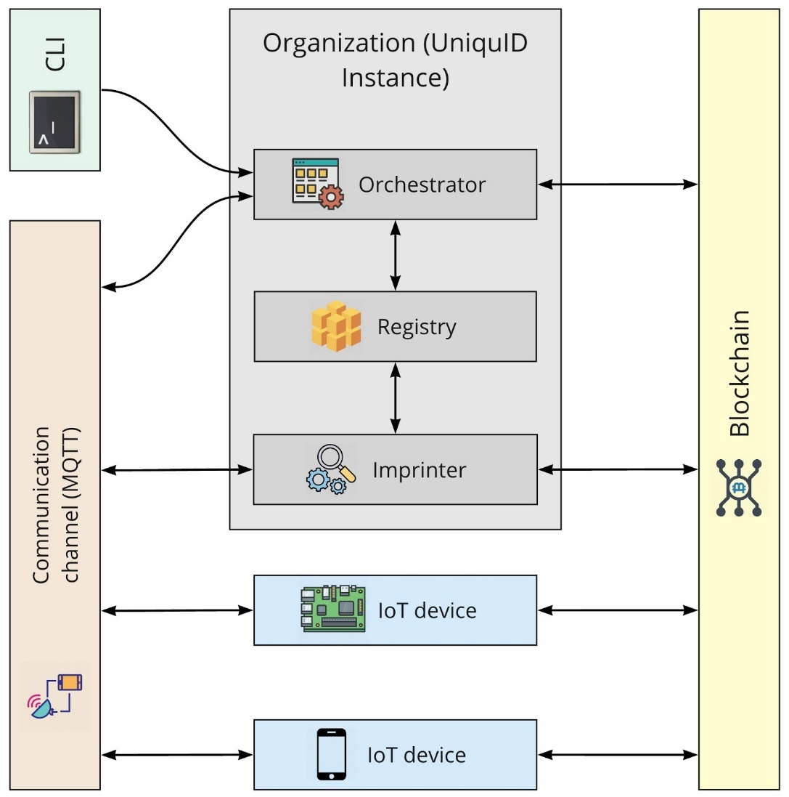
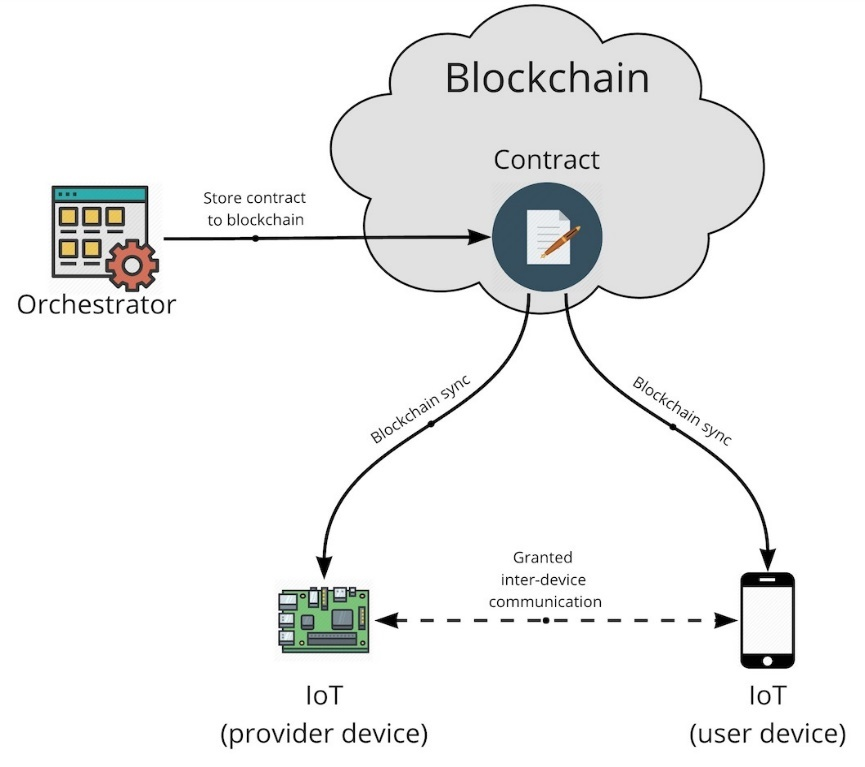
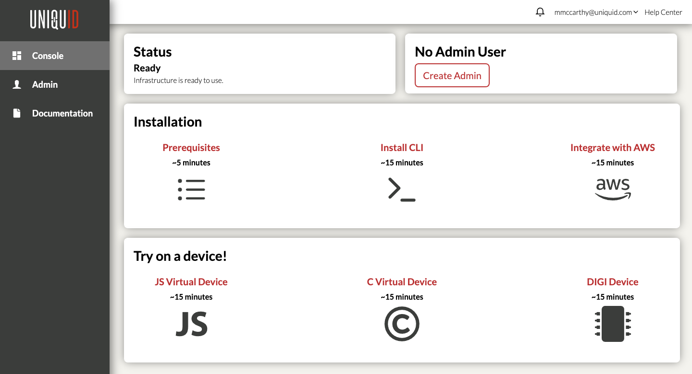

# Advanced Topics

| **System Architecture** |
| :---: |
| Advanced Topics |

| Document ID | uid-sys-arch |
| :--- | :--- |
| Version | 1.0 |
| Status | Release |

## Advanced Topics

This section explains with technical detail how the components of the UniquID system  interact, and the low-level protocol works. This section is not necessary to understand how to use UniquID, but it could be useful to better understand the implications of using an underlying blockchain instead of traditional, centralized services.

UniquID solution is a _layer two application_, built on top of the Litecoin blockchain. UniquID uses the transactions stored inside the blocks  as the infrastructure to implement its IAM system.

### **Backend Services**

#### **Overview**

Although UniquID is based on a public blockchain, the system leverages a set of centralized services to configure the Identity and Access Management of the Agents, and correctly issue the transactions on the ledger. These services are:

* Identity Self-Provisioning Service \(ISPS, aka “The Imprinter”\)
* Permission Management Service \(PMS, aka “The Orchestrator”\)
* Asset Registry \(aka “the Registry”\)

These three services provide the management tools to the administrator  of given UniquID Organization. These tools manage all of the blockchain implementation so developers and system designers don’t have to learn it or deal with it.

Each of these services have to interact with the other management services, while also connecting with the devices and the applications running the UniquID Agent .

As of today, UniquID leverages two classes of communication channels:

* Any Identity or Access Contract transaction leverage the peer-to-peer network of of Litecoin nodes, by using standard transactions broadcast
* RPC calls and data exchange between Agents leverages locally available resources \(e.g., MQTT / TCP / Bluetooth / WiFi...\).

Fig 7 shows UniquID services and how they interact with IoT devices:

Fig 7. UniquID Backend Services

Within an ideal scenario, UniquID Backend Services are used for the initial provisioning of new Agents and the creation and revocation of Access Contracts between them \(e.g., Agents running inside IoT devices and services\). In general UniquID Backend Services are used for creating and modifying the configuration settings of the permissions for the whole set of the  Organization’s Agents.

UniquID services can be deployed in two ways:

* Cloud infrastructure deployment - each Organization is located within isolated instances, behind UniquID’s SaaS running on AWS
* On-premises infrastructure deployment - his option supports companies with specific security and compliance needs, for example to run the _Imprinter_ and the _Orchestrator_ services inside isolated local networks, for air-gap IoT devices provisioning.

#### **Identity Self-Provisioning Service \(ISPS\)**

The ISPS, called Imprinter Service, is a critical component  that manages the provisioning of new Agents \(as mentioned, IoT devices or applications\) inside the Organization.

The Imprinter works in automatic mode: once a new IoT device connects to the communication channel \(e.g., MQTT\) the UniquID Agent running on it announces itself. The Imprinter automatically captures this message, and begins the provisioning process by writing a unique record to the blockchain.

Ensuring security of this process  is a key aspect of a correct and secure use of UniquID’s service. Correclty using the _Identity Self-Provisioning_ allows the Organization to block attackers from  enrolling unauthorized Agents to the Organization's network, therefore excluding it from the Orchestrator Asset Registry of devices.  and If an Agent is not inside an Orchestrator’s Asset Registry, no Contracts can be issued to it.

On the practical side, UniquID Imprinter Service is necessary to provision new devices or services to the Organization, but it can be performed by third parties, much before the IoT device is deployed. We should assume theImprinter service will be used only once in the lifecycle of an IoT  device, for example, at the manufacturing implant, when the device is built, assembled or tested.-

In the future, a factory might provide IoT devices already registered with UniquID Imprinter service, putting them in a pre-provisioned state,  for future use inside a specific Organization. UniquID designed the Imprinter service to apply a unique digital serial number to a device during the manufacturing process, identifying it by a tamper-resistant transaction on the Litecoin blockchain.

After the new device is  visible on the blockchain, it can be safely dispatched to the store for selling, or supplied to the customer. In this scenario, the customer gets the device ready  to launch the Orchestration process and get provisioned into its own specific Organization.

The Imprinter doesn’t need any manual command to operate, and runs in automatic mode listening for any new Agent. The service implements a set of RESTful HTTPs APIs functions to control the service status, and the Agents that are being registered in the organization \(as mentioned, IoT devices or applications\).

You can find links to Imprinter HTTP API specification in Appendix section.

#### **Permission Management Service**

The Orchestrator service commands and controls the Contracts that manage the interaction between the IoT devices and the applications inside its Organization. The Orchestrator is designed to create, issue and revoke the Contracts between the Agents, as soon as they were previously provisioned using the Imprinting service. To operate, the Orchestrator service, requires commands issued by RESTful HTTPs API functions. 

The list of available API functions is provided in the Appendix section.

The access to an Orchestrator API calls is protected by the accounts management system, which runs a basic API authentication service. In order to issue commands, the administrator has to complete the authentication process and get the secret key to call the API.

#### **Asset Registry Service**

The Registry Service provides the repository of Agents under a certain Organization. It is necessary to match the provider Agent name and provider Agent unique blockchain address. For example, when a user Agent \(e.g., an IoT device\) receives an Access Contract, it needs to identify which is the associated provider Agent to contact.

Essentially, the Asset Registry Service provides the equivalent of a digital label for every Contract, with the name of the provider Agent on it. The provider Agent name is also needed in these two additional scenarios:

 - to _get_ the contracts for a specific Agent

* To identify and reach the Agent  to open a session \(e.g., using its MQTT topic\)

#### **Communication Channel \(MQTT\)**

In the default implementation, we use the MQTT channel for the communication between the Agents.

This Communication channel has two main uses:

* Data exchange between IoT devices, as usually see within the IoT space
* Data exchange between IoT devices and the UniquID Services within their Organization

UniquID also supports communications via TCP/IP, and fully supports low-footprint transport protocols like Bluetooth and unencrypted WiFi. UniquID’s services payload is protocol-agnostic, so it is possible to adopt custom communication transport and protocols \(e.g. LoRa\).

### **Contracts**

A UniquID _Contract_ represents the agreement between UniquID Agents \(which can be IoT devices or applications\) that enforces the access rights within a UniquID organization.C Contracts  command and control three key principles:

* The identification system to match every Contract with the related Agents
* The communication channel being used for the data exchange \(e.g., session authentication\)
* The  access to RPC calls sent through the communication channel

UniquID provides contract management functionalities \(such as orchestration and revocation\) through the Permission Management Service \(PMS, aka the _Orchestrator_\). Access Contracts are stored in the blockchain by issuing micro-transactions thus, IoT devices trust Contracts changes by keeping the synchronization with the underlying Blockchain - as usually happens with normal cryptocurrency wallets.

A Contract is mandatory to open secure sessions between two IoT devices - of which one is the _User Agent_  and the other a _Provider Agent_. This logical distinction exists only at the Contract level: every Agent within the Organization can be User and Provider, depending on the underlying Contract. As an example, an IoT gateway can be the _User_ of cloud IoT applications, and _Provider_ of the MQTT broker for local, low-range wireless sensors.

Every Contract can be disabled: during its creation, the administrator elects a third entity, the _Revoker Agent_, which is entitled to disable - revoke - the Contract by issuing a transaction on the blockchain. By default the Revoker Agent is the Provider Agent itself, which controls the process via RPC, however the administrator can elect any other Agent belonging to the same Organization, and disable the contract remotely.

UniquID Contracts are embedded inside standard blockchain transaction, so the logic is governed by standard inputs and outputs composition, as defined by UTXO principles.

The table below describes how transaction inputs and outputs are defined inside standard UniquID Contracts. The OP\_RETURN contains the protocol metadata, storing the Access Control List \(ACL\). The order of inputs and outputs is fixed: the Provider Agent must use the Output\[0\] \(user address public key hash\) to authenticate the User Agent.

Table 2.  New Contract Parameters

| Input | Output |
| :--- | :--- |
| 0 - provider address | 0 - user address |
|  | 1 - OP\_RETURN |
|  | 2 - revoker address |
|  | 3 - change address\* |

\* the change address is needed to comply with the blockchain protocol

Every Contract is managed through the Orchestrator, which is capable of two main actions: _contract creation_ and _contract revocation_.

#### **Contract Creation**

_The contract creation_ process follows this sequence of actions:

1. The _Orchestrator_ creates a contract between two selected Agents, of which one is the _User Agent_, and the other is the _Provider Agent_. The Contract is embedded inside a blockchain transaction object, using standard inputs and outputs.
2. The Orchestrator sends the Contract transaction to the Provider Agent asking the signature
3. The Provider Agent sends back the signed transaction to the Orchestrator
4. The Orchestrator stores locally the signed transaction as a new Contract, and broadcasts it to the blockchain
5. As soon as the Agents are synchronized with the blockchain, they can download and store newly issued transactions as Contracts
6. Agents save the Contracts in the local database, acting as a cryptocurrency wallet
7. _User_ and _provider_ Agents can use the transaction data to open a  communication and call RPCs

Fig. 8. Contract creation between Provider and User  Agents \(e.g. IoT devices\).

#### **Contract Revocation**

_The Contract_ _revocation_, at the high level, works the same of contract creation. At the protocol level, a new transaction is spent on the blockchain, but with a different organization between inputs and outputs:  

Table 3. Revocation Contract transaction

| Input | Output |
| :--- | :--- |
| 0 - revoker address | 0 - provider address |
|  | 1 - user address |
|  | 2 - change address\* |

\* the change address is needed to comply with the blockchain protocol

The Revoker Agent pubkey is stored at the input\[0\], while Provider and User Agent pubkey hashes are stored at the output\[0\] and output\[1\].This transaction is generated by the Orchestrator, signed by the Revoker and broadcasted to the blockchain.

Since the transactions for Contract creation and Contract revocation are stored in the blockchain,security audits may be simplified.

### **Access Control List**

The Access Control List \(ACL\) is defined in the OP\_RETURN field of each UniquID Contract, and contains the information about the permissions that the Provider Agent can grant to the User. 

Each permission is identified by a specific RPC function executed on the device.

Table 4.  Access Control List Fields

<table>
  <thead>
    <tr>
      <th style="text-align:left">byte index</th>
      <th style="text-align:left">bit length</th>
      <th style="text-align:left">Functionality</th>
      <th style="text-align:left">Description</th>
      <th style="text-align:left">Value</th>
    </tr>
  </thead>
  <tbody>
    <tr>
      <td style="text-align:left">0</td>
      <td style="text-align:left">8</td>
      <td style="text-align:left">-</td>
      <td style="text-align:left">version</td>
      <td style="text-align:left">0 - for contract v.0</td>
    </tr>
    <tr>
      <td style="text-align:left">1 - 4</td>
      <td style="text-align:left">32</td>
      <td style="text-align:left">0-31</td>
      <td style="text-align:left">bitmask - execution grants for system reserved RPC</td>
      <td style="text-align:left">
        
0 - access denied

        
1 - access granted

      </td>
    </tr>
    <tr>
      <td style="text-align:left">5 - 18</td>
      <td style="text-align:left">112</td>
      <td style="text-align:left">32-143</td>
      <td style="text-align:left">bitmask - execution grants for application defined RPC</td>
      <td style="text-align:left">
        
0 - access denied

        
1 - access granted

      </td>
    </tr>
    <tr>
      <td style="text-align:left">19 - 79</td>
      <td style="text-align:left">488</td>
      <td style="text-align:left">-</td>
      <td style="text-align:left">unused</td>
      <td style="text-align:left">Must be 0</td>
    </tr>
  </tbody>
</table>

Based on this schema, every RPC functionality is uniquely identified by an index between 0 and 143 of the OP\_RETURN payload. The first 32 are reserved for UniquID Agent internal use, the remaining 112 are available for custom functions.

Developers that need to embed the Agent inside their IoT device or application have to map the ACL identifiers \(from 32 to 143\) to the functions/objects hey already have in place. Normally, each ACL index is mapped with a function RPC, so the administrator can enable/disable each of them using the Orchestrator. 

Table 5. Connected Car ACL Example

<table>
  <thead>
    <tr>
      <th style="text-align:left">byte index</th>
      <th style="text-align:left">bit index</th>
      <th style="text-align:left">Functionality</th>
      <th style="text-align:left">Description</th>
      <th style="text-align:left">Value</th>
    </tr>
  </thead>
  <tbody>
    <tr>
      <td style="text-align:left">0</td>
      <td style="text-align:left"></td>
      <td style="text-align:left">-</td>
      <td style="text-align:left">version</td>
      <td style="text-align:left">0 - for contract v.0</td>
    </tr>
    <tr>
      <td style="text-align:left">1 - 4</td>
      <td style="text-align:left"></td>
      <td style="text-align:left">0-31</td>
      <td style="text-align:left">bitmask - execution grants for system reserved RPC</td>
      <td style="text-align:left">
        
0 - access denied

        
1 - access granted

      </td>
    </tr>
    <tr>
      <td style="text-align:left">5</td>
      <td style="text-align:left">0</td>
      <td style="text-align:left">32</td>
      <td style="text-align:left">bitmask - can open and close doors</td>
      <td style="text-align:left">
        
0 - access denied

        
1 - access granted

      </td>
    </tr>
    <tr>
      <td style="text-align:left">5</td>
      <td style="text-align:left">1</td>
      <td style="text-align:left">33</td>
      <td style="text-align:left">bitmask - can open the trunk</td>
      <td style="text-align:left">
        
0 - access denied

        
1 - access granted

      </td>
    </tr>
    <tr>
      <td style="text-align:left">5</td>
      <td style="text-align:left">2</td>
      <td style="text-align:left">34</td>
      <td style="text-align:left">bitmask - can turn on the ignition</td>
      <td style="text-align:left">
        
0 - access denied

        
1 - access granted

      </td>
    </tr>
    <tr>
      <td style="text-align:left">5</td>
      <td style="text-align:left">3 - 7</td>
      <td style="text-align:left">35-39</td>
      <td style="text-align:left">bitmask - not used in the use case</td>
      <td style="text-align:left">X - don&#x2019;t care</td>
    </tr>
    <tr>
      <td style="text-align:left">6-18</td>
      <td style="text-align:left"></td>
      <td style="text-align:left">40-143</td>
      <td style="text-align:left">bitmask - not used in the use case</td>
      <td style="text-align:left">X - don&#x2019;t care</td>
    </tr>
    <tr>
      <td style="text-align:left">19-79</td>
      <td style="text-align:left"></td>
      <td style="text-align:left"><em>-</em>
      </td>
      <td style="text-align:left">unused</td>
      <td style="text-align:left">0</td>
    </tr>
  </tbody>
</table>

### **Message structure and RPC**

UniquID Framework defines a structure for the message structure, that is agnostic from the communication protocol. This approach leaves the  developer free to choose the ideal communication protocol \(e.g., MQTT, CoAP, HTTPs\), based on the existing requirements. The framework adopts message and RPC structure  inspired by JSON-RPC, without strictly following its implementation.

While in the JSON-RPC \[...\], within the UniquID messaging framework, the User Agent sends a request to the Provider Agent and wait for a response.

When the Provider Agent receives an RPC request, it begins the handshake process, following these steps:

* check if there exists a valid Contract with the User \(among the Contracts stored in the local cache\) 
* if a Contract exists, the Provider compares the RPC request index with the Contract bitmask, to verify if the User has permission to  access that specific functionality.
* If the Contract contains the bit of the requested RPC set to 1, the Provider executes the correspondent method and send back the response to the User, otherwise the Provider discards the request, and doesn't answer.

An example of RPC exchange between User and  Provider might be:

<table>
  <thead>
    <tr>
      <th style="text-align:left">Request</th>
    </tr>
  </thead>
  <tbody>
    <tr>
      <td style="text-align:left">
        
{

        
&quot;body&quot;: {

        
&quot;Method&quot;:32,

        
&quot;Params&quot;:&quot;008000000000c3d9&quot;,

        
&quot;id&quot;:1564140714421

        
},

        
&quot;signature&quot;:&quot;INaJMkHy8rh8SN1+CBjUdGsrnFAaXHVScpbltasEsWE/PLIVhsbmwgYCu3B2VWFbp40FQNULNq9pG6qSiw2gr/E=&quot;

        
}

      </td>
    </tr>
  </tbody>
</table>

Table 6.  Request Message Structure

| Parameter | Type | Description |
| :--- | :--- | :--- |
| method | number | Method requested by the User Agent \(requestor\) |
| params | string | Optional parameters used by the method. The application running on top of the Provider Agent implements the function to parse it |
| id | integer/big num | Normally the request’s timestamp. Any response message must contain the same id |
| signature | string | Bitcoin signature of the serialized “body: { }” JSON message component  |

<table>
  <thead>
    <tr>
      <th style="text-align:left">Response</th>
    </tr>
  </thead>
  <tbody>
    <tr>
      <td style="text-align:left">
        
{

        
&quot;Body&quot;:{

        
&quot;Result&quot;:&quot;&quot;,

        
&quot;Error&quot;:0,

        
&quot;Id&quot;:1564140714421

        
},

        
&quot;signature&quot;:&quot;IEz3+gpCy1bewFrC1rN+wGqbSIzf1tv5O12xPBFzAGDQCifvwZTqIFa+R9ZzAjMebX/uG5uPVUeFbv29yfUwsa4=&quot;

        
}

      </td>
    </tr>
  </tbody>
</table>

Table 7.  Response Message Structure.

| Parameter | Type | Description |
| :--- | :--- | :--- |
| result | string | The reply to the requested method. The application running on top of the User Agent implements the function to parse it. Any execution error or exception  can be reported here |
| error | number | Error at messaging level \(e.g. malformed JSON\). If error == 0 the request is successful and the result is stored in the "result" field |
| id | number | The same id of the Request Message timestamp. |
| signature | string | Bitcoin signature of the serialized “body: { }” JSON message component fields |

#### **Message Signature and Authentication**

Every signature in the UniquID Message protocol leverages the “Bitcoin message signature” algorithm. Therefore, the signature is applied to the _digest_ of the serialized JSON message.

The serialization algorithm for the request json is:

  
**sprintf\(serializeData,"%d%s" PRId64 "", method, params, id\);**

The above example request

{

"body": {

"Method":32,

"Params":"008000000000c3d9",

"id":1564140714421

},

"signature":"INaJMkHy8rh8SN1+CBjUdGsrnFAaXHVScpbltasEsWE/PLIVhsbmwgYCu3B2VWFbp40FQNULNq9pG6qSiw2gr/E="

}

will return:

  
**char serializeData\[\] = "32008000000000c3d91564140714421";**

The “Bitcoin message signature” algorithm is executed  as

**base64\(recoveriByte \|\| ecdsa\( sha256\( sha256\( "\x18" "Bitcoin Signed Message:" "\n" + varint\(serializeDataLen\) + serializeData\) \) \) \)**

Where **\|\|** represent the concatenation of the recoveryByte with the ECDSA algorithm.

The serialization algorithm for the response JSON is:

**sprintf\(serializeData,"%d%s" PRId64 "", error, result, id\)**

The example above will give:

**char serializeData\[\] = "01564140714421";**

The signature algorithm is the same as described above for the request.

A feature of this ECDSA signature implementation is that a public key can be calculated by knowing:

* the data itself
* the signature applied to it 
* the ECDSA recoveryByte

Therefore,  there’s no need for the Provider Agent to know the public key \(relative to the private key\) of the User Agent that signed the message. Once the public key is calculated, its validity is calculated by comparing it with the Blockchain Address present on the Contract \(which is the hash of the public key itself\). 

UniquID Agents, by leveraging this feature,  can securely identify and authenticate the source of a given request, leveraging the Contract information instead of a centralized PKI.

## UniquID System Administration

### **Console**

Once you have registered your new Organization on UniquID, you have to download the credentials for your account from the Console web application, by clicking the “Create Admin” button in the top-right section of the main page. The credentials file is needed to authenticate the UniquID command-line tool \(CLI\) to the UniquID backend services.

Fig. 9.  UniquID Administration Console

This Console web application also allows you to delete your Organization’s account. WARNING: this action is irreversible, and any metadata provided by UniquID Backend Services will be deleted. Therefore, the Agents you provisioned into the system may no longer function correctly.

### **Command-Line Interface tool \(CLI\)**

UniquID’s Command-Line Interface \(CLI\) provides the administrator a tool to interact with the UniquID backend services using standard _\*nix_ command-line interface. The commands accept input arguments as files in the JSON format, and data can be printed to the standard output in either text or JSON format.

The tool is developed using Python3 and it can be downloaded from PyPi.org using the ‘pip3’ package installation tool.  Full instructions on how to install the tool are available at:

    [https://pypi.org/project/uniquid/](https://pypi.org/project/uniquid/)

Once the tool is installed correctly, you will need to download the credentials file for your Organization from the UniquID Console. WARNING: this credentials file must be kept in a secure location as it allows whoever has it in their possession to login to the backend services, and modify the state of the Contracts inside your UniquID Organization.

The CLI tool provides several commands and many of these accept options to modify the command’s behaviour. Table 8 briefly describes the available commands.  Full documentation for each command is available using the ‘uniquid --help’ option, or appending ‘--help’ option to a specific command \(e.g., ‘uniquid login --help’\).

Table 8.  UniquID CLI Tool Commands

<table>
  <thead>
    <tr>
      <th style="text-align:left">Command</th>
      <th style="text-align:left">Description</th>
    </tr>
  </thead>
  <tbody>
    <tr>
      <td style="text-align:left">login</td>
      <td style="text-align:left">Use the secret credentials to authenticate the CLI tool with the UniquID
        backend services</td>
    </tr>
    <tr>
      <td style="text-align:left">logout</td>
      <td style="text-align:left">Remove the previous authentication between the CLI tool and the UniquUD
        backend services</td>
    </tr>
    <tr>
      <td style="text-align:left">status</td>
      <td style="text-align:left">View the status of the authentication between the CLI tool and the UniquID
        backend services</td>
    </tr>
    <tr>
      <td style="text-align:left">log</td>
      <td style="text-align:left">View the log generated by the UniquID backend services in real-time</td>
    </tr>
    <tr>
      <td style="text-align:left">list-aliases</td>
      <td style="text-align:left">View a list of short aliases which are available for the CLI tool&#x2019;s
        commands. All commands have a corresponding alias</td>
    </tr>
    <tr>
      <td style="text-align:left">list-devices</td>
      <td style="text-align:left">View a list of all of the UniquID Agents, including IoT devices and other
        applications, whose identities have been imprinted and orchestrated</td>
    </tr>
    <tr>
      <td style="text-align:left">show-device</td>
      <td style="text-align:left">Show detailed information about a specific UniquID agent</td>
    </tr>
    <tr>
      <td style="text-align:left">list-contracts</td>
      <td style="text-align:left">View a list of all of the Access Contracts, both active and revoked, which
        exist between UID Agents</td>
    </tr>
    <tr>
      <td style="text-align:left">show-contract</td>
      <td style="text-align:left">Show detailed information about a specific Access Contract</td>
    </tr>
    <tr>
      <td style="text-align:left">create-contracts</td>
      <td style="text-align:left">Create an Access Contract between two UniquID Agents</td>
    </tr>
    <tr>
      <td style="text-align:left">delete-contracts</td>
      <td style="text-align:left">Revoke an existing Access Contract</td>
    </tr>
    <tr>
      <td style="text-align:left">deploy</td>
      <td style="text-align:left">
        
Creates the infrastructure and resources necessary to integrate the UniquID
          system with a third-party system.
           There are currently two options for this command:

        <ul>
          <li>Basic. Generate the configuration file which is used to configure UniquID
            Agents to connect to your organization.</li>
          <li>AWS. Generates the configuration file and certificate which are necessary
            to connect a UniquID Agent to your organization in the UniquID system and
            to your organization&#x2019;s AWS IoT Core infrastructure.
             This option also creates the necessary infrastructure in AWS so that your
            UniquID organization is connected to your AWS IoT Core infrastructure</li>
        </ul>
      </td>
    </tr>
    <tr>
      <td style="text-align:left">undeploy</td>
      <td style="text-align:left">
        
There is currently one option for this command:

        <ul>
          <li>AWS. Deletes the AWS infrastructure which was created by previously executing
            the &#x2018;deploy aws&#x2019; command</li>
        </ul>
      </td>
    </tr>
  </tbody>
</table>

  
The CLI tool creates a log file in your current working directory when you execute a command. One log file is created for each day and the log from all commands are appended to the log file.  The name of the log file is:

uniquid\_cli\_&lt;date in YYMMDD format&gt;.log

The command-line tool can be installed on Linux, OSX and Windows machines. WARNING: the commands ‘deploy’ and ‘undeploy’ are not currently supported on Windows machines.

#### **CLI Real-Time Logging**

It is possible to monitor the logs generated by the UniquID backend services in realtime, launching the CLI tool with the ‘uniquid log’ command. This command will display the log containing information about major events in the system. Some of the events which may appear in the log are:

* Time since the last blockchain block was mined
* Identity Self-Provisioning Service \(ISPS aka Imprinter\) events from the UniquID backend services
* Permission Management Service \(PMS aka Orchiestrator\) events from the UniquID backend services

#### **CLI Custom Scripts**

The CLI tool can be used to automate tasks using custom scripts. These scripts can be written in a programming language such as Python or Ruby. The programming language must provide two key features:

* ability to execute command-line tools and analyze their output
* ability to parse and change data in JSON format

Below, a short example script which is written in Python. This script shows the convenience to automatically capture and analyse the output from the UniquID CLI tool. These scripts can be conveniently streamlined within any existing Identity and Access Management platform, automating the creation and cancellation of Access Contracts or Capability Contracts.

Example Script:

\#! /usr/bin/env python3

import json

import shlex

import subprocess

import sys

if \_\_name\_\_ == '\_\_main\_\_':

    \# Retrieve a list of UniquID devices in JSON format and

    \# convert to a Python dictionary.

    devices\_cmd = 'uniquid ld -o json'

    arg\_list = shlex.split\(devices\_cmd\)

    result = subprocess.run\(arg\_list,

                            stdout=subprocess.PIPE,

                            stderr=subprocess.PIPE\)

    if result.returncode != 0:

        sys.exit\('List devices command failed'\)

    devices\_str = result.stdout.decode\('utf-8'\)

    devices\_list = json.loads\(devices\_str\)

    \# Retrieve a list of UniquID contracts in JSON format and

    \# convert to a Python dictionary.

    contracts\_cmd = 'uniquid lc -o json'

    arg\_list = shlex.split\(contracts\_cmd\)

    result = subprocess.run\(arg\_list,

                            stdout=subprocess.PIPE,

                            stderr=subprocess.PIPE\)

    if result.returncode != 0:

        sys.exit\('List contracts command failed'\)

    contracts\_str = result.stdout.decode\('utf-8'\)

    contracts\_list = json.loads\(contracts\_str\)

    \# create a contract between the first and second devices.

    contract\_dict = {'functions': \[38, 39\]}

    if len\(devices\_list\) &lt; 2:

        sys.exit\('Must have at least 2 devices to create a contract'\)

    contract\_dict\['provider'\] = devices\_list\[0\]\['xpub'\]

    contract\_dict\['user'\] = devices\_list\[1\]\['xpub'\]

    new\_list = \[contract\_dict\]

    print\(new\_list\)

    \# Create the new contract

    contract\_cmd = 'uniquid cc --input-json \'' + json.dumps\(new\_list\) + '\''

    print\(contract\_cmd\)

    arg\_list = shlex.split\(contract\_cmd\)

    result = subprocess.run\(arg\_list,

                            stdout=subprocess.PIPE,

                            stderr=subprocess.PIPE\)

    if result.returncode != 0:

        sys.exit\('Contract creation command failed'\)

    contracts\_str = result.stdout.decode\('utf-8'\)

    print\(contracts\_str\)

    sys.exit\(0\)

